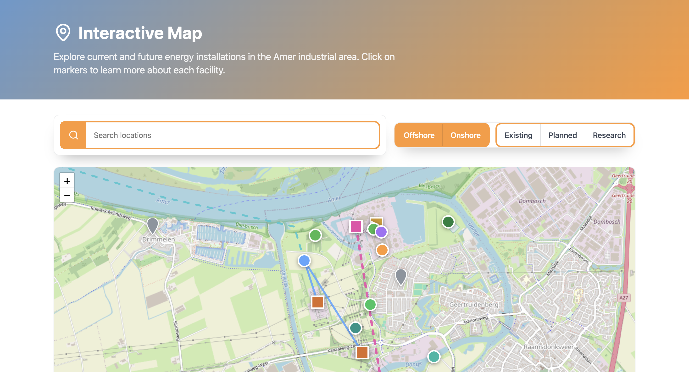

# Interactive Energy Infrastructure Map

An interactive web-based map visualizing energy infrastructure and future development projects in the Amer region (Geertruidenberg) of the Netherlands.

## Features

- Interactive Leaflet.js map
- Offshore and onshore infrastructure visualization
- Search functionality
- Location filtering system
- Planned and existing infrastructure markers
- Energy transition project visualization
- Responsive user interface
- Custom popups with project details
- District heating, hydrogen, battery, and CO₂ project layers

---

## Technologies Used

- HTML5
- CSS3
- JavaScript
- Leaflet.js
- OpenStreetMap

---

## Project Preview

---

## Included Infrastructure

### Offshore Energy

- Nederwiek 3 Offshore Wind Farm

### Grid Infrastructure

- Converter stations
- TenneT substations
- HVDC cable routes

### Energy Systems

- Hydrogen production
- Battery storage
- District heating
- CO₂ capture projects

### Nature Development

- Ecological corridors
- River restoration areas
- Landscape projects

---

## How to Run the Project

1. Download or clone the repository
2. Open the project folder
3. Open `index.html` in your browser

---

## Data & Sources

Infrastructure and project information are based on publicly available planning and energy transition resources.

---

## Author

Created by Izekor Kingsley
